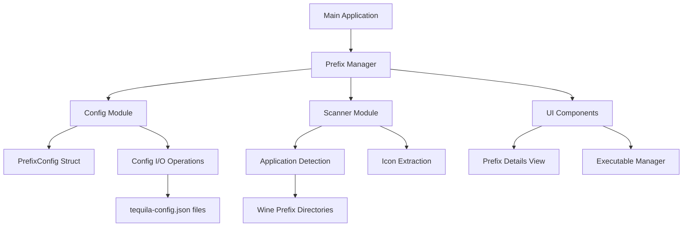
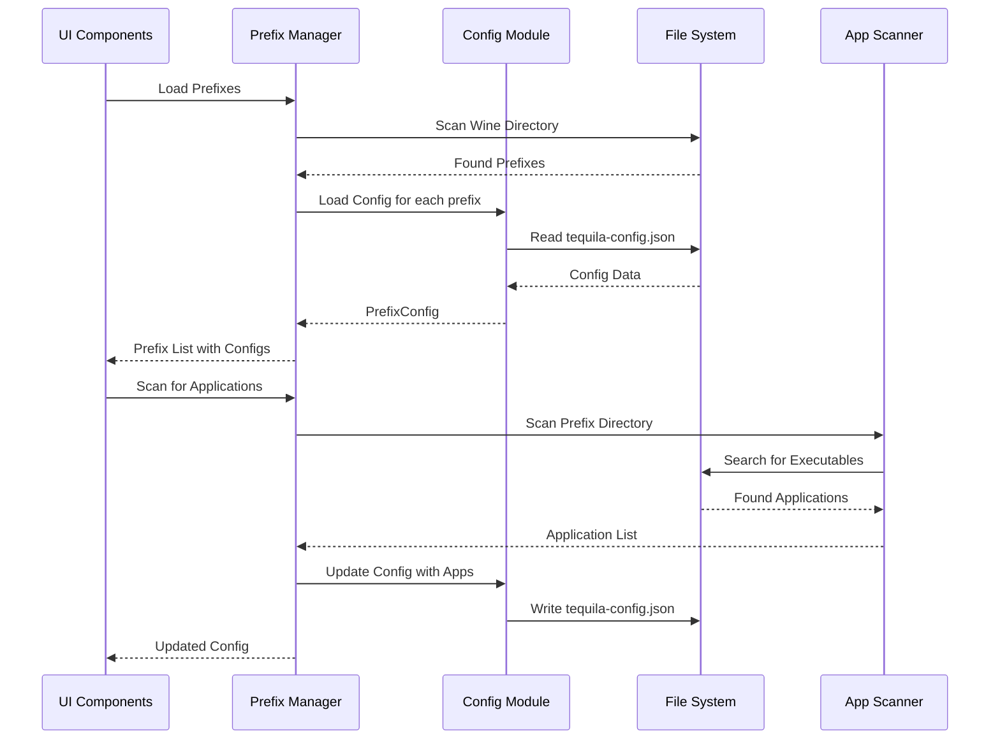

# Wine Prefix Configuration Implementation Plan

## Module Architecture Diagram



## Data Flow Diagram



## Detailed Implementation Steps

### 1. Update Cargo.toml with Required Dependencies

```toml
[dependencies]
dirs = "6.0.0"
gtk4 = "0.10.1"
relm4 = {version = "0.10.0", features = ["libadwaita"]}
tokio = "1.48.0"
serde = { version = "1.0", features = ["derive"] }
serde_json = "1.0"
chrono = { version = "0.4", features = ["serde"] }
walkdir = "2.3"
```

### 2. Create Prefix Module Structure

First, create the module directory and files:

```
src/
├── main.rs
├── prefix/
│   ├── mod.rs
│   ├── config.rs
│   ├── manager.rs
│   └── scanner.rs
└── ui/
    ├── prefix_details.rs
    └── app_manager.rs
```

### 3. Implement PrefixConfig Structure (config.rs)

```rust
use serde::{Deserialize, Serialize};
use chrono::{DateTime, Utc};
use std::path::PathBuf;

#[derive(Debug, Clone, Serialize, Deserialize)]
pub struct PrefixConfig {
    pub version: String,
    pub name: String,
    pub creation_date: DateTime<Utc>,
    pub last_modified: DateTime<Utc>,
    pub wine_version: Option<String>,
    pub architecture: String,
    pub description: Option<String>,
    pub registered_executables: Vec<RegisteredExecutable>,
}

#[derive(Debug, Clone, Serialize, Deserialize)]
pub struct RegisteredExecutable {
    pub name: String,
    pub description: Option<String>,
    pub icon_path: Option<PathBuf>,
    pub executable_path: PathBuf,
}

impl PrefixConfig {
    pub fn new(name: String, architecture: String) -> Self {
        let now = Utc::now();
        Self {
            version: "1.0.0".to_string(),
            name,
            creation_date: now,
            last_modified: now,
            wine_version: None,
            architecture,
            description: None,
            registered_executables: Vec::new(),
        }
    }

    pub fn save_to_file(&self, prefix_path: &PathBuf) -> Result<(), Box<dyn std::error::Error>> {
        let config_path = prefix_path.join("tequila-config.json");
        let json = serde_json::to_string_pretty(self)?;
        std::fs::write(config_path, json)?;
        Ok(())
    }

    pub fn load_from_file(prefix_path: &PathBuf) -> Result<Option<Self>, Box<dyn std::error::Error>> {
        let config_path = prefix_path.join("tequila-config.json");
        
        if !config_path.exists() {
            return Ok(None);
        }

        let content = std::fs::read_to_string(config_path)?;
        let config: PrefixConfig = serde_json::from_str(&content)?;
        Ok(Some(config))
    }

    pub fn update_last_modified(&mut self) {
        self.last_modified = Utc::now();
    }

    pub fn add_executable(&mut self, executable: RegisteredExecutable) {
        self.registered_executables.push(executable);
        self.update_last_modified();
    }

    pub fn remove_executable(&mut self, index: usize) {
        if index < self.registered_executables.len() {
            self.registered_executables.remove(index);
            self.update_last_modified();
        }
    }
}
```

### 4. Implement Prefix Manager (manager.rs)

```rust
use crate::prefix::config::{PrefixConfig, RegisteredExecutable};
use crate::prefix::scanner::ApplicationScanner;
use std::path::PathBuf;
use std::fs;

pub struct PrefixManager {
    wine_dir: PathBuf,
    scanner: ApplicationScanner,
}

impl PrefixManager {
    pub fn new(wine_dir: PathBuf) -> Self {
        Self {
            wine_dir,
            scanner: ApplicationScanner::new(),
        }
    }

    pub fn scan_prefixes(&self) -> Result<Vec<WinePrefix>, Box<dyn std::error::Error>> {
        let mut prefixes = Vec::new();
        
        if let Ok(entries) = fs::read_dir(&self.wine_dir) {
            for entry in entries.flatten() {
                let path = entry.path();
                if path.is_dir() {
                    // Check if this directory looks like a Wine prefix
                    let drive_c = path.join("drive_c");
                    let system_reg = path.join("system.reg");
                    
                    if drive_c.exists() && system_reg.exists() {
                        if let Some(name) = path.file_name().and_then(|n| n.to_str()) {
                            let config = self.load_or_create_config(&path, name)?;
                            prefixes.push(WinePrefix {
                                name: name.to_string(),
                                path: path.clone(),
                                config,
                            });
                        }
                    }
                }
            }
        }
        
        prefixes.sort_by(|a, b| a.name.cmp(&b.name));
        Ok(prefixes)
    }

    fn load_or_create_config(&self, prefix_path: &PathBuf, name: &str) -> Result<PrefixConfig, Box<dyn std::error::Error>> {
        // Try to load existing config
        if let Some(config) = PrefixConfig::load_from_file(prefix_path)? {
            return Ok(config);
        }

        // Create a new config for existing prefix
        let mut config = PrefixConfig::new(name.to_string(), "win64".to_string());
        
        // Try to detect wine version
        if let Ok(wine_version) = self.detect_wine_version(prefix_path) {
            config.wine_version = Some(wine_version);
        }

        // Save the new config
        config.save_to_file(prefix_path)?;
        Ok(config)
    }

    fn detect_wine_version(&self, prefix_path: &PathBuf) -> Result<String, Box<dyn std::error::Error>> {
        // Implementation to detect wine version from prefix
        // This could check registry files or other indicators
        Ok("unknown".to_string())
    }

    pub fn create_prefix(&self, name: &str, architecture: &str) -> Result<PathBuf, Box<dyn std::error::Error>> {
        let prefix_path = self.wine_dir.join(name);
        
        // Create prefix directory
        fs::create_dir_all(&prefix_path)?;
        
        // Create initial config
        let config = PrefixConfig::new(name.to_string(), architecture.to_string());
        config.save_to_file(&prefix_path)?;
        
        // TODO: Actually create wine prefix using wine command
        // winecfg --arch win64 --prefix prefix_path
        
        Ok(prefix_path)
    }

    pub fn scan_for_applications(&self, prefix_path: &PathBuf) -> Result<Vec<RegisteredExecutable>, Box<dyn std::error::Error>> {
        self.scanner.scan_prefix(prefix_path)
    }

    pub fn update_config(&self, prefix_path: &PathBuf, config: &PrefixConfig) -> Result<(), Box<dyn std::error::Error>> {
        let mut updated_config = config.clone();
        updated_config.update_last_modified();
        updated_config.save_to_file(prefix_path)?;
        Ok(())
    }
}

#[derive(Debug, Clone)]
pub struct WinePrefix {
    pub name: String,
    pub path: PathBuf,
    pub config: PrefixConfig,
}
```

### 5. Implement Application Scanner (scanner.rs)

```rust
use crate::prefix::config::RegisteredExecutable;
use std::path::PathBuf;
use walkdir::WalkDir;

pub struct ApplicationScanner {
    // Common Windows application directories
    app_dirs: Vec<&'static str>,
}

impl ApplicationScanner {
    pub fn new() -> Self {
        Self {
            app_dirs: vec![
                "drive_c/Program Files",
                "drive_c/Program Files (x86)",
                "drive_c/users",
                "drive_c/ProgramData/Microsoft/Windows/Start Menu/Programs",
            ],
        }
    }

    pub fn scan_prefix(&self, prefix_path: &PathBuf) -> Result<Vec<RegisteredExecutable>, Box<dyn std::error::Error>> {
        let mut executables = Vec::new();
        
        for app_dir in &self.app_dirs {
            let full_path = prefix_path.join(app_dir);
            if full_path.exists() {
                executables.extend(self.scan_directory(&full_path)?);
            }
        }
        
        Ok(executables)
    }

    fn scan_directory(&self, dir_path: &PathBuf) -> Result<Vec<RegisteredExecutable>, Box<dyn std::error::Error>> {
        let mut executables = Vec::new();
        
        for entry in WalkDir::new(dir_path).max_depth(3).into_iter().flatten() {
            let path = entry.path();
            
            if path.is_file() {
                if let Some(extension) = path.extension().and_then(|e| e.to_str()) {
                    if extension.eq_ignore_ascii_case("exe") {
                        if let Some(executable) = self.create_executable_from_path(path)? {
                            executables.push(executable);
                        }
                    }
                }
            }
        }
        
        Ok(executables)
    }

    fn create_executable_from_path(&self, path: &PathBuf) -> Result<Option<RegisteredExecutable>, Box<dyn std::error::Error>> {
        // Extract name from file path
        let name = path.file_stem()
            .and_then(|n| n.to_str())
            .unwrap_or("Unknown")
            .to_string();
        
        // Try to find icon file
        let icon_path = self.find_icon_for_executable(path)?;
        
        Ok(Some(RegisteredExecutable {
            name,
            description: None, // Could be enhanced with metadata extraction
            icon_path,
            executable_path: path.to_path_buf(),
        }))
    }

    fn find_icon_for_executable(&self, exe_path: &PathBuf) -> Result<Option<PathBuf>, Box<dyn std::error::Error>> {
        // Look for icon files with the same name as the executable
        if let Some(parent) = exe_path.parent() {
            if let Some(stem) = exe_path.file_stem() {
                let icon_extensions = vec!["ico", "icns", "png"];
                
                for ext in icon_extensions {
                    let icon_path = parent.join(format!("{}.{}", stem.to_str().unwrap_or(""), ext));
                    if icon_path.exists() {
                        return Ok(Some(icon_path));
                    }
                }
            }
        }
        
        Ok(None)
    }
}
```

### 6. Update Main Application Integration

Modify the existing `main.rs` to integrate with the new prefix management system:

```rust
use gtk::prelude::*;
use relm4::{gtk, ComponentParts, ComponentSender, RelmApp, RelmWidgetExt, SimpleComponent};
use std::path::PathBuf;
use std::fs;

// Import the new modules
mod prefix;
mod ui;

use prefix::manager::{PrefixManager, WinePrefix};

struct AppModel {
    prefixes: Vec<WinePrefix>,
    prefix_manager: PrefixManager,
    selected_prefix: Option<usize>,
}

#[derive(Debug)]
enum AppMsg {
    CreatePrefix,
    DeletePrefix(usize),
    LaunchPrefix(usize),
    LaunchExecutable(usize, usize), // prefix index, executable index
    RefreshPrefixes,
    SelectPrefix(usize),
    UpdateList,
    ScanForApplications(usize),
}

impl AppModel {
    fn scan_wine_prefixes(prefix_manager: &PrefixManager) -> Vec<WinePrefix> {
        match prefix_manager.scan_prefixes() {
            Ok(prefixes) => prefixes,
            Err(e) => {
                eprintln!("Error scanning prefixes: {}", e);
                Vec::new()
            }
        }
    }
}

// Update the view and other methods to work with the new WinePrefix structure
// ...
```

## Implementation Benefits

1. **Structured Data**: JSON configuration provides a structured way to store prefix metadata
2. **Extensibility**: Easy to add new fields to the configuration schema
3. **Persistence**: Configuration is preserved across application restarts
4. **User Experience**: Enhanced UI with detailed prefix information
5. **Application Management**: Easy launching and management of installed applications

## Testing Strategy

1. **Unit Tests**: Test individual components (config serialization, scanner)
2. **Integration Tests**: Test the complete prefix management workflow
3. **UI Tests**: Test the user interface interactions
4. **Edge Cases**: Test with corrupted configs, missing files, etc.

## Migration Strategy

For existing installations:
1. Detect prefixes without configs on startup
2. Generate basic configs with available metadata
3. Save configs to prefix directories
4. Optionally notify users about the new configuration system