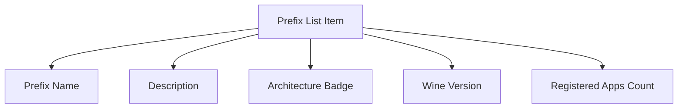

# Wine Prefix Configuration UI Design

## Overview

This document outlines the user interface design for the wine prefix configuration system, including how users will interact with prefix metadata and manage registered executables.

## Main UI Enhancements

### 1. Enhanced Prefix List

The prefix list will be enhanced to show more information from the configuration:



Each prefix item will display:
- Prefix name (prominent)
- Optional description (smaller text)
- Architecture badge (win32/win64)
- Wine version (if available)
- Number of registered applications

### 2. Prefix Details Panel

When a prefix is selected, a details panel will show comprehensive information:

```
┌─────────────────────────────────────────┐
│ Prefix Details                        │
├─────────────────────────────────────────┤
│ Name: Gaming Prefix                   │
│ Description: For gaming applications   │
│ Created: 2025-10-24 08:00:00        │
│ Modified: 2025-10-24 08:30:00       │
│ Wine Version: wine-10.0              │
│ Architecture: win64                   │
│                                     │
│ [Edit Details] [Scan for Apps]       │
├─────────────────────────────────────────┤
│ Registered Applications (3)           │
│ ┌─────────────────────────────────────┐ │
│ │ 🎮 Steam                         │ │
│ │    Steam Game Client               │ │
│ │    [Launch] [Remove]              │ │
│ └─────────────────────────────────────┘ │
│ ┌─────────────────────────────────────┐ │
│ │ 📝 Notepad++                     │ │
│ │    Text Editor                     │ │
│ │    [Launch] [Remove]              │ │
│ └─────────────────────────────────────┘ │
│ ┌─────────────────────────────────────┐ │
│ │ 🎯 Some Game                     │ │
│ │    Game Description                │ │
│ │    [Launch] [Remove]              │ │
│ └─────────────────────────────────────┘ │
│                                     │
│ [Add Application]                   │
└─────────────────────────────────────────┘
```

### 3. Edit Prefix Details Dialog

A dialog for editing prefix metadata:

```
┌─────────────────────────────────────────┐
│ Edit Prefix Details                     │
├─────────────────────────────────────────┤
│ Name: [Gaming Prefix           ]        │
│ Description: [For gaming applications]  │
│ Wine Version: wine-10.0                 │
│ Architecture: win64                     │
│                                         │
│ Creation Date: 2025-10-24 08:00:00      │
│ Last Modified: 2025-10-24 08:30:00      │
│                                         │
│                         [Cancel] [Save] │
└─────────────────────────────────────────┘
```

### 4. Scan for Applications Dialog

A dialog showing detected applications:

```
┌─────────────────────────────────────────┐
│ Scan for Applications                   │
├─────────────────────────────────────────┤
│ Scanning prefix for applications...     │
│ ████████████████████░░░░ 75%            │
│                                         │
│ Found 12 applications                   │
│                                         │
│ ☑ Steam.exe                             │
│ ☑ Notepad++.exe                         │
│ ☐ somegame.exe                          │
│ ☐ anotherapp.exe                        │
│                                         │
│ [Select All] [Clear All]                │
│                                         │
│          [Cancel] [Add Selected]        │
└─────────────────────────────────────────┘
```

### 5. Add Application Dialog

Manual application addition:

```
┌─────────────────────────────────────────┐
│ Add Application                         │
├─────────────────────────────────────────┤
│ Name: [My Application           ]       │
│ Description: [App description    ]      │
│ Executable: [Browse...        ]         │
│ Icon: [Browse...             ]          │
│                                         │
│ Preview:                                │
│ ┌─────────┐  My Application             │
│ │   📱    │  App description            │
│ └─────────┘                             │
│                                         │
│          [Cancel] [Add]                 │
└─────────────────────────────────────────┘
```

## UI Component Structure

### 1. Updated Main Layout

```rust
#[relm4::component]
impl SimpleComponent for AppModel {
    view! {
        gtk::ApplicationWindow {
            set_title: Some("Tequila - Wine Prefix Manager"),
            set_default_width: 1000, // Increased width
            set_default_height: 700,

            gtk::Box {
                set_orientation: gtk::Orientation::Vertical,
                set_spacing: 10,
                set_margin_all: 10,

                // Header bar (unchanged)
                gtk::Box {
                    set_orientation: gtk::Orientation::Horizontal,
                    set_spacing: 10,
                    set_margin_bottom: 15,
                    // ... existing header content
                },

                // Main content area - updated layout
                gtk::Box {
                    set_orientation: gtk::Orientation::Horizontal,
                    set_spacing: 10,

                    // Left panel - Enhanced prefix list
                    gtk::ScrolledWindow {
                        set_vexpand: true,
                        set_hexpand: true,
                        set_policy: (gtk::PolicyType::Never, gtk::PolicyType::Automatic),
                        set_width_request: 400,

                        #[name = "prefix_list"]
                        gtk::ListBox {
                            set_css_classes: &["boxed-list"],
                            set_margin_all: 5,
                        }
                    },

                    // Right panel - Prefix details
                    gtk::ScrolledWindow {
                        set_vexpand: true,
                        set_hexpand: true,
                        set_policy: (gtk::PolicyType::Never, gtk::PolicyType::Automatic),
                        set_width_request: 550,

                        #[name = "prefix_details"]
                        gtk::Box {
                            set_orientation: gtk::Orientation::Vertical,
                            set_spacing: 10,
                            set_margin_all: 10,
                            
                            // Details will be populated dynamically
                            gtk::Label {
                                set_label: "No prefix selected",
                                add_css_class: "dim-label",
                                set_halign: gtk::Align::Center,
                                set_valign: gtk::Align::Center,
                                set_vexpand: true,
                            }
                        }
                    }
                },

                // Status bar (unchanged)
                gtk::Box {
                    set_orientation: gtk::Orientation::Horizontal,
                    set_spacing: 5,
                    set_margin_top: 10,
                    // ... existing status content
                }
            }
        }
    }
}
```

### 2. Prefix List Item Component

```rust
struct PrefixListItem {
    prefix: WinePrefix,
}

#[relm4::component]
impl SimpleComponent for PrefixListItem {
    type Init = WinePrefix;
    type Input = ();
    type Output = ();

    view! {
        gtk::ListBoxRow {
            set_selectable: true,
            
            gtk::Box {
                set_orientation: gtk::Orientation::Vertical,
                set_spacing: 5,
                set_margin_all: 10,

                gtk::Box {
                    set_orientation: gtk::Orientation::Horizontal,
                    set_spacing: 10,

                    gtk::Label {
                        set_label: &self.prefix.name,
                        add_css_class: "heading",
                        set_hexpand: true,
                        set_halign: gtk::Align::Start,
                    },

                    gtk::Label {
                        set_label: &self.prefix.config.architecture,
                        add_css_class: "badge",
                        add_css_class: if self.prefix.config.architecture == "win64" { "success" } else { "accent" },
                    }
                },

                gtk::Label {
                    set_label: self.prefix.config.description.as_deref().unwrap_or("No description"),
                    add_css_class: "caption",
                    set_halign: gtk::Align::Start,
                    set_wrap: true,
                    set_wrap_mode: gtk::pango::WrapMode::WordChar,
                },

                gtk::Box {
                    set_orientation: gtk::Orientation::Horizontal,
                    set_spacing: 10,
                    set_margin_top: 5,

                    gtk::Label {
                        set_label: &format!("🍷 {}", 
                            self.prefix.config.wine_version.as_deref().unwrap_or("Unknown wine")),
                        add_css_class: "caption",
                    },

                    gtk::Label {
                        set_label: &format!("📱 {} apps", self.prefix.config.registered_executables.len()),
                        add_css_class: "caption",
                        set_hexpand: true,
                        set_halign: gtk::Align::End,
                    }
                }
            }
        }
    }
}
```

### 3. Prefix Details Component

```rust
struct PrefixDetails {
    prefix: Option<WinePrefix>,
}

#[derive(Debug)]
enum PrefixDetailsMsg {
    UpdatePrefix(WinePrefix),
    EditDetails,
    ScanForApplications,
    LaunchExecutable(usize),
    RemoveExecutable(usize),
    AddApplication,
}

#[relm4::component]
impl SimpleComponent for PrefixDetails {
    type Init = Option<WinePrefix>;
    type Input = PrefixDetailsMsg;
    type Output = AppMsg;

    view! {
        gtk::Box {
            set_orientation: gtk::Orientation::Vertical,
            set_spacing: 10,
            set_margin_all: 10,

            #[watch]
            match &self.prefix {
                Some(prefix) => {
                    gtk::Box {
                        set_orientation: gtk::Orientation::Vertical,
                        set_spacing: 15,

                        // Prefix information
                        gtk::Box {
                            set_orientation: gtk::Orientation::Vertical,
                            set_spacing: 10,
                            set_css_classes: &["card"],

                            gtk::Label {
                                set_label: &prefix.name,
                                add_css_class: "title-2",
                            },

                            gtk::Label {
                                set_label: prefix.config.description.as_deref().unwrap_or("No description"),
                                add_css_class: "body",
                                set_wrap: true,
                            },

                            gtk::Grid {
                                set_row_spacing: 5,
                                set_column_spacing: 10,
                                set_margin_top: 10,

                                attach: (0, 0, 1, 1),
                                gtk::Label {
                                    set_label: "Created:",
                                    add_css_class: "caption",
                                },

                                attach: (1, 0, 1, 1),
                                gtk::Label {
                                    set_label: &prefix.config.creation_date.format("%Y-%m-%d %H:%M:%S").to_string(),
                                    add_css_class: "caption",
                                },

                                attach: (0, 1, 1, 1),
                                gtk::Label {
                                    set_label: "Wine:",
                                    add_css_class: "caption",
                                },

                                attach: (1, 1, 1, 1),
                                gtk::Label {
                                    set_label: prefix.config.wine_version.as_deref().unwrap_or("Unknown"),
                                    add_css_class: "caption",
                                },

                                attach: (0, 2, 1, 1),
                                gtk::Label {
                                    set_label: "Architecture:",
                                    add_css_class: "caption",
                                },

                                attach: (1, 2, 1, 1),
                                gtk::Label {
                                    set_label: &prefix.config.architecture,
                                    add_css_class: "caption",
                                }
                            },

                            gtk::Box {
                                set_orientation: gtk::Orientation::Horizontal,
                                set_spacing: 10,
                                set_margin_top: 10,
                                set_halign: gtk::Align::End,

                                gtk::Button {
                                    set_label: "Edit Details",
                                    connect_clicked => PrefixDetailsMsg::EditDetails,
                                },

                                gtk::Button {
                                    set_label: "Scan for Apps",
                                    connect_clicked => PrefixDetailsMsg::ScanForApplications,
                                    add_css_class: "suggested-action",
                                }
                            }
                        },

                        // Registered applications
                        gtk::Box {
                            set_orientation: gtk::Orientation::Vertical,
                            set_spacing: 10,
                            set_css_classes: &["card"],

                            gtk::Label {
                                set_label: &format!("Registered Applications ({})", prefix.config.registered_executables.len()),
                                add_css_class: "heading",
                            },

                            gtk::ScrolledWindow {
                                set_vexpand: true,
                                set_min_content_height: 200,
                                set_policy: (gtk::PolicyType::Never, gtk::PolicyType::Automatic),

                                #[name = "executables_list"]
                                gtk::ListBox {
                                    set_css_classes: &["boxed-list"],
                                }
                            },

                            gtk::Button {
                                set_label: "Add Application",
                                connect_clicked => PrefixDetailsMsg::AddApplication,
                                set_halign: gtk::Align::Center,
                            }
                        }
                    }
                }
                None => {
                    gtk::Box {
                        set_orientation: gtk::Orientation::Vertical,
                        set_halign: gtk::Align::Center,
                        set_valign: gtk::Align::Center,
                        set_vexpand: true,

                        gtk::Image {
                            set_icon_name: Some("wine-symbolic"),
                            set_pixel_size: 64,
                            add_css_class: "dim-label",
                        },

                        gtk::Label {
                            set_label: "No prefix selected",
                            add_css_class: "title-4",
                            add_css_class: "dim-label",
                            set_margin_top: 10,
                        },

                        gtk::Label {
                            set_label: "Select a prefix from the list to view details",
                            add_css_class: "body",
                            add_css_class: "dim-label",
                        }
                    }
                }
            }
        }
    }
}
```

## User Interaction Flow

### 1. Selecting a Prefix

1. User clicks on a prefix in the list
2. Details panel updates to show prefix information
3. Registered applications are displayed with launch options
4. Actions become available (edit, scan, etc.)

### 2. Scanning for Applications

1. User clicks "Scan for Apps" button
2. Progress dialog shows scanning progress
3. Found applications are listed with checkboxes
4. User selects applications to add
5. Selected applications are added to registered list
6. Configuration is saved automatically

### 3. Launching Applications

1. User clicks "Launch" button next to an application
2. Application is launched using the wine prefix
3. Optional: Add to recent applications list

## CSS Styling

Additional CSS classes for enhanced appearance:

```css
.card {
    background-color: alpha(@theme_bg_color, 0.5);
    border-radius: 12px;
    padding: 15px;
    border: 1px solid alpha(@theme_fg_color, 0.1);
}

.badge {
    padding: 4px 8px;
    border-radius: 12px;
    font-size: 0.8em;
    font-weight: 600;
}

.badge.success {
    background-color: alpha(@success_color, 0.2);
    color: @success_color;
}

.badge.accent {
    background-color: alpha(@accent_color, 0.2);
    color: @accent_color;
}

.executable-item {
    padding: 10px;
    border-radius: 8px;
    transition: background-color 200ms;
}

.executable-item:hover {
    background-color: alpha(@theme_fg_color, 0.05);
}
```

## Accessibility Considerations

1. **Keyboard Navigation**: All interactive elements accessible via keyboard
2. **Screen Reader Support**: Proper labels and descriptions for all elements
3. **High Contrast**: Ensure good color contrast for all text and badges
4. **Focus Indicators**: Clear focus states for all interactive elements

## Responsive Design

1. **Minimum Width**: Set minimum widths to prevent UI collapse
2. **Adaptive Layout**: Stack elements vertically on smaller screens
3. **Scrollable Areas**: Proper scrolling for long lists
4. **Text Wrapping**: Ensure text wraps properly on small screens